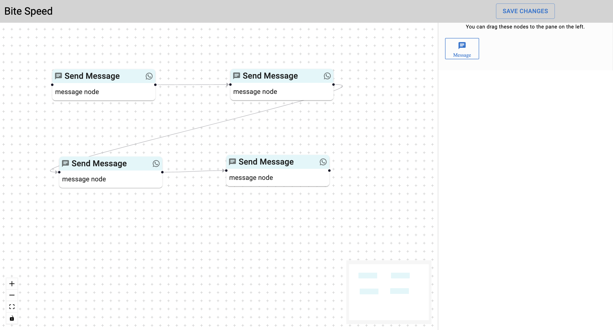
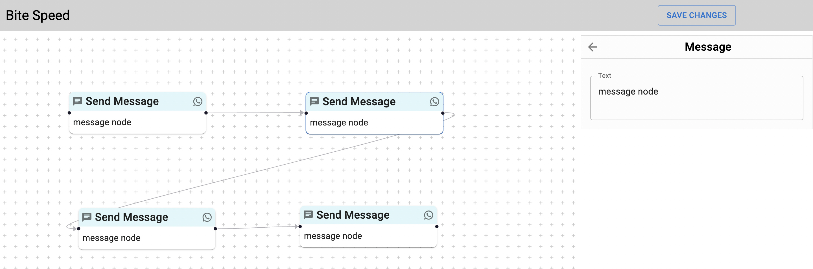
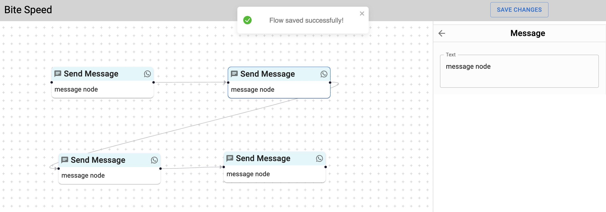
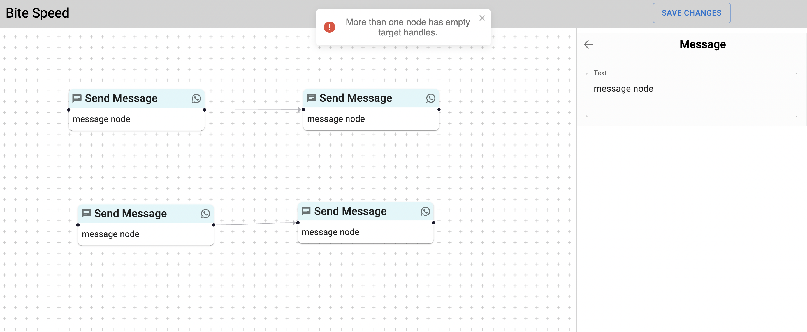

# Bite Speed Frontend Task

**Deployed Link**: [Bite Speed Frontend](https://bite-speed-frontend.vercel.app/)

## To extend with new nodes follow below instructions.

To add a new node in the nodes panel, the following configuration changes are necessary:

```javascript
// To add new node in nodes panel we need to change the below config in App.jsx file.

// Follow the already created custom node for reference in src/components/Customnodes/Message.jsx
const nodeTypes = { message: MessageNode };
const nodesConfig = [
  {
    mainNode: MessageNode, // main node for the react flow
    inputNode: MessageInput, // input node for the settings panel
    draggableNode: DraggableMessageNode, // draggable node used to create main node.
    type: "message", // type of the node.
  },
];
```

---

## Screenshots

### Chat Builder Flow



### Settings Panel



### Success Status



### Failure Status



---
